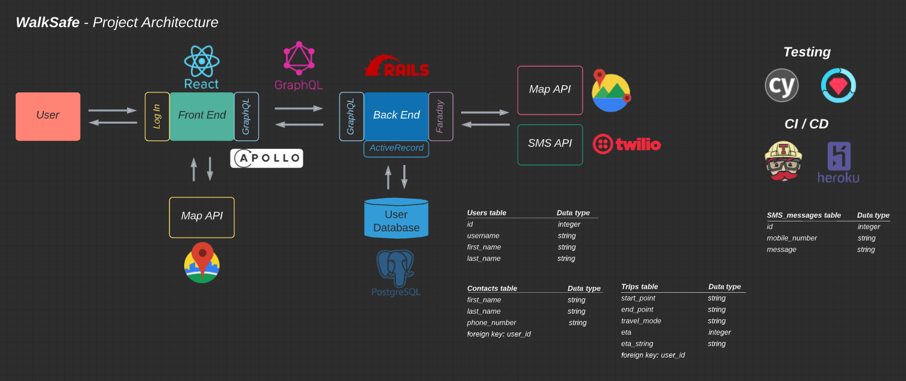
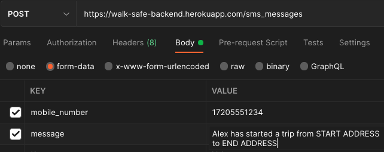

<!-- PROJECT SHIELDS -->
[](https://travis-ci.com/Walk-Safe/walk-safe-backend)
[![Forks][forks-shield]][forks-url]
[![Issues][issues-shield]][issues-url]


<!-- TABLE OF CONTENTS -->
## Table of contents
[**About The Project**](#about-the-project) |
[**Created By**](#created-by) |
[**Built With**](#built-with) |
[**Setup**](#setup) |
[**Endpoints**](#endpoints) |
[**Tests**](#running-the-tests) |
[**Roadmap**](#roadmap) |
[**Acknowledgements**](#acknowledgements)


<!-- ABOUT THE PROJECT -->
## About The Project
<!-- [![Product Name Screen Shot][product-screenshot]](https://example.com) -->
Welcome to Walk Safe! Created to empower individuals to walk alone, Walk Safe brings a user's community along from the trip. Utilizing Geolocation and SMS messaging APIs, we keep a user's community informed of their trip status from start to finish. Should an unforeseen trip interruption arise, Walk Safe will immediately alert the user's contact. We've got your back.

This repository contains our backend Rails app. This app makes calls to Google's Distance Matrix API and exposes API endpoints to our [frontend React API](https://github.com/Walk-Safe/walk-safe-frontend).
This project is deployed on Heroku (https://walk-safe-backend.herokuapp.com/ , endpoints only).


<!-- DEVELOPERS -->
## Created By
###### Back End Team
Gaelyn Cooper [GitHub](https://github.com/gaelyn) [LinkedIn](https://www.linkedin.com/in/gaelyn-cooper/)

Joe Mecha [GitHub](https://github.com/joemecha) [LinkedIn](https://www.linkedin.com/in/joemecha/)

Mike Foy [GitHub](https://github.com/foymikek) [LinkedIn](https://www.linkedin.com/in/michael-foy-707ba7b4/)


###### Front End Team
Bryan Hohn [GitHub](https://github.com/bhohnco) [LinkedIn](https://www.linkedin.com/in/bryanhohn)

Caroline Eubanks [GitHub](https://github.com/cmeubanks) [LinkedIn](https://www.linkedin.com/in/eubankscaroline/)

Peter Muellerleile [GitHub](https://github.com/pcmueller) [LinkedIn](http://www.linkedin.com/in/pcmueller)


## Built With
* [Ruby](https://www.ruby-lang.org/en/documentation/) (version 2.5.3p105)
* [Ruby on Rails](https://rubyonrails.org/) (version 5.2.6)
* [PostgreSQL](https://www.postgresql.org/) (version 13)

This project was tested with:
* [RSpec](https://github.com/rspec/rspec-rails) version 3.10
* [Postman](https://www.postman.com/) Explore and test the API endpoints
* [pry] https://github.com/pry/pry
* [VCR] https://github.com/vcr/vcr

Continous Integration:
* [Travis CI](https://travis-ci.com/)

Deployed with:
* [Heroku](www.heroku.com)

## Project Architecture


## Setup
* Clone the [walk-safe-backend](https://github.com/Walk-Safe/walk-safe-backend.git) repository from your terminal  
```
  git clone git@github.com:Walk-Safe/walk-safe-backend.git`
```
* Change directories to the cloned directory  
```
cd walk-safe-backend
```
* Install gems
```  
bundle install
```
* Set up the database
```
rails db:{create,migrate,seed}
```
* Obtain an API key from [Google Distance Matrix API](https://developers.google.com/maps/documentation/distance-matrix/get-api-key#creating-api-keys). You will also need credentials from [Twilio](https://www.twilio.com/docs/usage/tutorials/how-to-use-your-free-trial-account) if you wish to use the SMS messaging portion of the application.
* We use the [Figaro](https://github.com/laserlemon/figaro) gem to securely store secret keys.
  * Run `bundle exec figaro install` from your terminal.
  * This will create a `config/application.yml` file and also adds it to your `.gitignore` file so it won't get pushed to Github.   
  * Now add your keys to `config/application.yml` as shown below
  * Note that your Twilio keys must be in string format
```
google_api_key: <your Google Maps API key>
account_sid: '<your Twilio SID>'
auth_token: '<your Twilio auth token>'
twilio_number: '<your Twilio phone number>'
```  
* Now you can start your server
```
rails s
```
* Visit http://localhost:3000/graphiql or use Postman to post queries and mutations as show below in the Endpoints section.
* The test suit can be run with
```
bundle exec rspec
```

## Endpoints

### ```/graphql```
Endpoints use a __`POST`__ method, relying on GraphQL to perform queries and mutations of data.

1. Queries must be sent in the __request body__ as shown below.
2. The create trip mutation relies on a third party API - [Google's Distance Matrix](https://developers.google.com/maps/documentation/distance-matrix/overview).

### GraphQL Queries
__Find all users__
```
{
  allUsers {
	firstName
    lastName
    username
    contacts {
      firstName
      lastName
      phoneNumber
    }
  }
}
```
__Find one user (requires user id)__
```
{
  oneUser(id: 1) {
	firstName
    lastName
    username
    contacts {
      firstName
      lastName
      phoneNumber
    }
  }
}
```


### GraphQL Mutations

__Create new user (requires: first_name, last_name, username)__
```
mutation {
  createUser(input: { firstName: "Claire", lastName: "Littleton", username: "lemonade" }) {
  user {
    id,
    firstName,
    lastName,
    username
  	}
  errors
	}
}
```

__Create new contact (requires: first_name, last_name, phone_number, user_id)__
```
mutation {
  createContact(input: {
	firstName: "Charlie",
    lastName: "Pace",
    phoneNumber: "+12625558333"
    userId: 10
  }) {
  contact {
    id
    firstName
    lastName
    phoneNumber
  	}
  errors
	}
}
```

__Create new trip (requires: start_point, end_point, travel_mode, user_id)__
_Note: possible travel modes are walking, bicycling, or driving_
```
mutation {
  createTrip(input: {startPoint: "Boulder CO", endPoint: "Longmont CO", travelMode: "bicycling", userId: 10}) {
    trip {
      startPoint
      endPoint
      travelMode
      eta
      etaString
      userId
    }
    errors
  }
}
```

### RESTful route
Text messages are sent utilizing a restful route:
https://walk-safe-backend.herokuapp.com/sms_messages

1. In the request, send the required information by form-data
2. The required fields are __mobile_number__ (beginning with country code (US is '1') followed by the rest of the number -- without punctuation) and __message__

__New SMS to contact__




## Roadmap
The team utilized a [github project board](https://github.com/orgs/Walk-Safe/projects/1) to organize project issues and coordinate workflow across six members, two teams and two repositories.
See the [open issues](https://github.com/Walk-Safe/walk-safe-backend/issues) for a list of proposed features (and known issues).

See the [open issues](https://github.com/Walk-Safe/walk-safe-backend/issues) for a list of proposed features (and known issues).

## Making a Contribution
1. Create your Feature Branch (`git checkout -b feature/AmazingFeature`)
2. Commit your Changes (`git commit -m 'Add some AmazingFeature'`)
3. Push to the Branch (`git push origin feature/AmazingFeature`)
4. Open a Pull Request


<!-- ACKNOWLEDGEMENTS -->
## Acknowledgements

Thank you to Google and Twilio for their free tiers allowing us to use their APIs in this project. We'd also like to thank [@dionew1](https://github.com/dionew1) and [@Kalikoze](https://github.com/Kalikoze) of Turing School of Software and Design for their guidance and support during the development process!

<!-- MARKDOWN LINKS & IMAGES -->
<!-- https://www.markdownguide.org/basic-syntax/#reference-style-links -->
[contributors-shield]: https://img.shields.io/github/contributors/Walk-Safe/walk-safe-backend.svg?style=for-the-badge
[contributors-url]: https://github.com/Walk-Safe/walk-safe-backend/graphs/contributors
[forks-shield]: https://img.shields.io/github/forks/Walk-Safe/walk-safe-backend.svg?style=for-the-badge
[forks-url]: https://github.com/Walk-Safe/walk-safe-backend/network/members
<!-- [stars-shield]: https://img.shields.io/github/stars/Walk-Safe/walk-safe-backend.svg?style=for-the-badge
[stars-url]: https://github.com/Walk-Safe/walk-safe-backend/stargazers -->
[issues-shield]: https://img.shields.io/github/issues/Walk-Safe/walk-safe-backend?style=for-the-badge
[issues-url]: https://github.com/Walk-Safe/walk-safe-backend/issues
<!-- [product-screenshot]: images/screenshot.png -->
